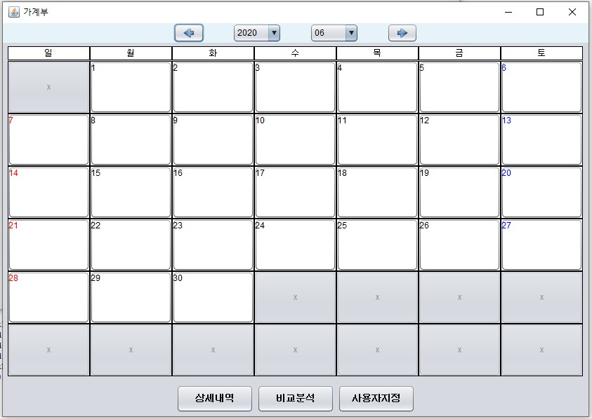
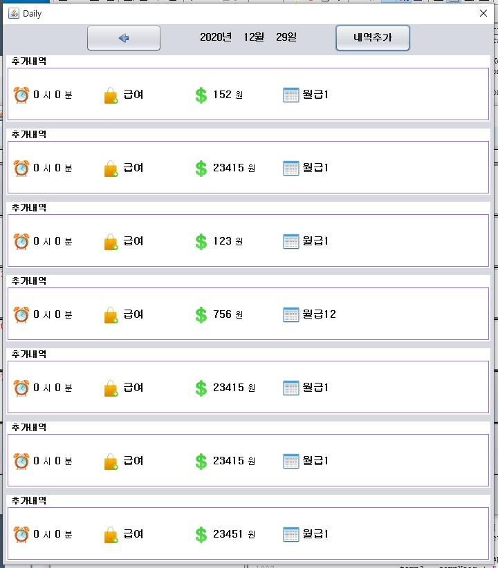
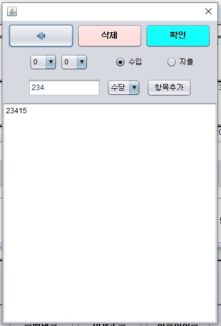
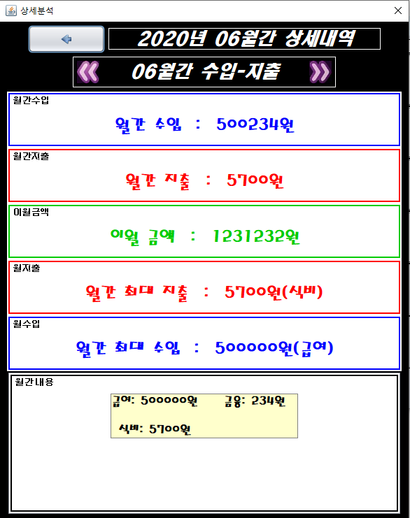
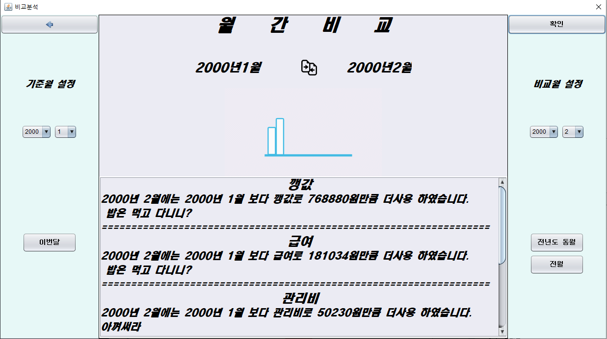
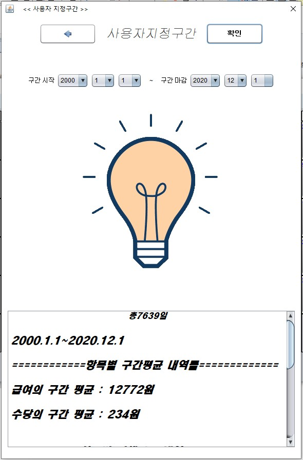

# SwingAccountBook

#### JavaSwing,stream

###### 가계부 만들기

**

피드백
**

#### 1. 달력패널 마지막 달 갔을때 이미지깨짐 현상

#### 2. DailyPanel쪽 JScrollPane 추가

#### 3. DO_NOTHING -> DISPOSE로

#### 4. Editor 기능에 따라 설명 적기

#### 5. 전달 메시지 상황에 따라 메시지 추가

#### 6. 윤년 계산은 했지만 UI에 일수가 안뜨는 현상

#### 7. 2000년부터 2020년이 아닌 2020년 기준으로 만들기(가계부 기간 기준)

**

UI
**

### 첫화면

### Daily

### 내역추가

### 상세내역

### 비교분석

### 사용자지정

